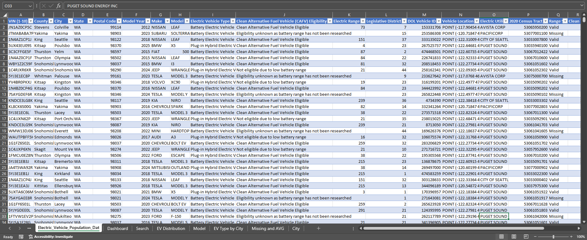
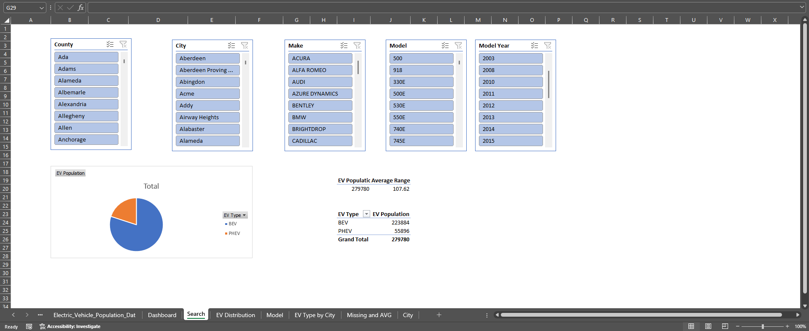

# Electric Vehicle Market Analysis Dashboard

## Project Overview

This project analyzes the Electric Vehicle Population dataset from Washington State to explore EV adoption patterns, technology differences, and geographic distribution. The goal was to transform raw public data into an interactive analytical dashboard using Excel while practicing data cleaning, data storytelling, and dashboard design.

The dashboard was built using Pivot Tables, Pivot Charts, slicers, and calculated fields to allow dynamic exploration by County, City, Brand, Model, and Model Year.

# Dashboard Preview

The dashboard was designed to provide interactive exploration of EV adoption patterns across Washington State.

---

# Project Goals

The main goals of this project were:

* Practice real-world data cleaning and exploratory data analysis
* Build an interactive dashboard in Excel
* Improve data storytelling and dashboard layout design
* Analyze EV market structure and technology trends
* Identify and handle missing or unreliable data correctly
* Develop stronger analytical thinking skills

---

# Thought Process

## 1. Understanding the Dataset

The dataset contains information about electric vehicles registered in Washington State, including:

* Vehicle Make and Model
* Electric Vehicle Type (BEV / PHEV)
* Electric Range
* Model Year
* County and City
* Utility and CAFV Eligibility information

At the beginning of the project, several limitations were identified:

* No purchase or registration date → unable to measure true EV growth over time
* Charging infrastructure information was unavailable
* Some electric range values were recorded as 0, which likely represented missing or unrecorded data rather than actual zero range

Recognizing these limitations helped avoid misleading analysis.

---

## 2. Data Cleaning Decisions

This show original data

Several cleaning and preparation steps were performed before analysis:

### Handling Missing Electric Range

Electric Range values equal to 0 were treated as missing values because:

* Many vehicles with 0 range also had CAFV eligibility listed as "Unknown"
* A true EV range of 0 is unrealistic for most records

To prevent misleading averages:

* A new field called `Clean Range` was created
* Only valid ranges (>0) were used for average calculations

### Created Calculated Fields

Additional fields were created to improve analysis:

* `Model + Year`
* `Range Status` (Valid / Missing)
* `Clean Range`

These fields helped support segmentation, filtering, and more accurate comparisons.

---

# Analysis Workflow

## Step 1 — Data Preparation

Data after cleaning

* Imported CSV dataset into Excel
* Converted raw data into an Excel Table
* Cleaned missing and invalid values
* Created calculated helper columns

---

## Step 2 — Exploratory Analysis

Pivot Tables were used to analyze:

### Market Structure

* EV distribution by Brand
* Most popular Models
* Top Brands and Top Models

### Technology Comparison

* BEV vs PHEV distribution
* Average electric range comparison
* EV Type distribution by City

### Geographic Analysis

* Top 10 Cities by EV population
* Geographic concentration of EV adoption

### Data Quality Analysis

* Missing vs Valid electric range records
* Identification of incomplete range data

---

## Step 3 — Visualization

Pivot Charts were used to visualize insights:

* Horizontal bar charts for Brand and Model comparisons
* Column charts for range analysis
* Stacked charts for EV Type by City
* KPI summary cards for high-level metrics

The charts were designed to:

* Reduce visual clutter
* Improve readability
* Support storytelling flow

---

## Step 4 — Dashboard Design 

Developed an interactive dashboard with a dedicated Search & Insights page, allowing users to explore EV data in greater detail through dynamic filtering by County, City, Brand, Model, and Year.

The dashboard layout was organized into sections:

### KPI Section

* Total EV Population
* BEV %
* PHEV %
* Average BEV Range
* Average PHEV Range
* Missing Range %

### Market Insight Section

* EV Distribution by Brand
* Top Models by Selected Brand

### Technology Insight Section

* EV Type Comparison
* Average Electric Range Analysis

### Geographic Insight Section

* EV Population by City
* EV Type Distribution by City

Interactive slicers were added to allow filtering by:

* County
* City
* Brand
* Model
* Year

---

# Key Insights

* EV adoption is concentrated among a few dominant brands and models
* Battery Electric Vehicles (BEV) significantly outnumber Plug-in Hybrid Electric Vehicles (PHEV)
* BEVs generally offer much higher electric range than PHEVs
* EV adoption is concentrated in major cities
* A portion of the dataset contains missing electric range information, which required special handling to avoid misleading averages

---

# Skills Demonstrated

## Technical Skills

* Excel
* Pivot Tables
* Pivot Charts
* Slicers
* Data Cleaning
* Dashboard Design

## Analytical Skills

* Exploratory Data Analysis (EDA)
* Data Validation
* Data Storytelling
* KPI Design
* Comparative Analysis
* Geographic Segmentation

---

# Future Improvements

Potential future improvements for this project include:

* Rebuilding the dashboard in Power BI
* Adding SQL-based preprocessing
* Incorporating charging infrastructure data
* Performing time-series analysis if registration dates become available
* Adding demographic or economic data for deeper geographic insights

---

# Conclusion

This project was designed not only to practice technical Excel skills, but also to develop analytical thinking and storytelling ability. The focus was on building a clean, interactive dashboard that transforms raw data into understandable business insights while carefully handling data quality issues.

